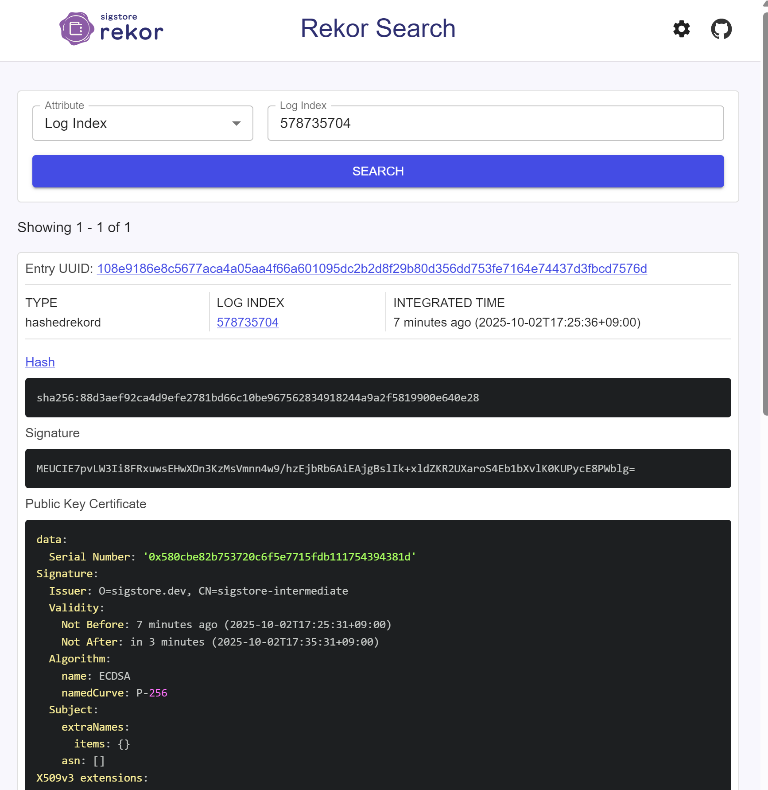

### cosign verify 실행 결과
```bash
# cosign verify 실행 결과
Verification for ghcr.io/jud1thdev/slsa-study-practice:sha-8600debd6cba98a61b35535036eca1fb3f6c1b93 --
The following checks were performed on each of these signatures:
  - The cosign claims were validated                  # cosign 서명 자체 검증
  - Existence of the claims in the transparency log was verified offline
  - The code-signing certificate was verified using trusted certificate authority certificates

# 서명된 이미지 정보
[{"critical":{"identity":{"docker-reference":"ghcr.io/jud1thdev/slsa-study-practice"},"image":{"docker-manifest-digest":"sha256:2500c77d4cf8ab7f2083ca37acefbf6cc8dc84cd184bd49d72f84320e21e6ee1"},"type":"cosign container image signature"},"optional":{
  "1.3.6.1.4.1.57264.1.1":"https://token.actions.githubusercontent.com",   # GitHub Actions OIDC
  "1.3.6.1.4.1.57264.1.2":"push",                                          # 트리거 이벤트
  "1.3.6.1.4.1.57264.1.3":"8600debd6cba98a61b35535036eca1fb3f6c1b93",      # 커밋 SHA
  "1.3.6.1.4.1.57264.1.4":"Build & Sign Image",                            # 워크플로우 이름
  "1.3.6.1.4.1.57264.1.5":"jud1thDev/SLSA-study-practice",                 # 저장소
  "1.3.6.1.4.1.57264.1.6":"refs/heads/main",                               # 브랜치
  "Bundle":{"SignedEntryTimestamp":"MEYCIQCZmPGnG2HijQrAh1I7X/U8UMnKLAz++94FiAzHGIYOtwIhAIBPs9gcFtLP0tc1boO7DSDLCn/UenF1d1d5TILFSZe5",
            "integratedTime":1759393536,                                   # Rekor 로그에 기록된 시간
            "logIndex":578735704,                                          # Rekor 로그 인덱스
            "logID":"c0d23d6ad406973f9559f3ba2d1ca01f84147d8ffc5b8445c224f98b9591801d"}}, 
  "Issuer":"https://token.actions.githubusercontent.com",                   # 인증서 발급자
  "Subject":"https://github.com/jud1thDev/SLSA-study-practice/.github/workflows/build-sign.yaml@refs/heads/main", # 인증서 주체(레포/워크플로우/브랜치)
  "githubWorkflowName":"Build & Sign Image",
  "githubWorkflowRepository":"jud1thDev/SLSA-study-practice",
  "githubWorkflowSha":"8600debd6cba98a61b35535036eca1fb3f6c1b93",
  "githubWorkflowTrigger":"push"}}]
```

### 위의 로그에서 나타난 logIndex 활용해서 Rekor 로그 확인


### 정리글
https://github.com/jud1thDev/SLSA-study-practice/blob/main/archive/Week02.md