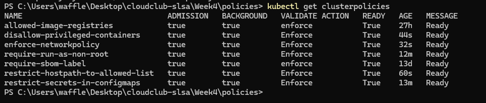

# A. CD Pipeline 정책 수립

## 1. 컨테이너의 호스트 권한소유 금지
- 컨테이너가 호스트의 모든 권한을 가지는 것은 호스트노드에 접근할 수 있는 심각한 취약점으로 발전할 수 있는 가능성이 있습니다.
- 따라서 관련 기능의 동작을 제한하는 것은 필연적이라 판단, 관련 정책을 적용했습니다.

```yaml
      # ...
        pattern:
          spec:
            =(containers): # 컨테이너 목록의 모든 항목에 대해 검사
              - =(securityContext): # securityContext의 아래 값이 다음과 같은지 검사
                  =(privileged): "false"
            =(initContainers): # 컨테이너 목록의 모든 항목에 대해 검사
              - =(securityContext):
                  =(privileged): "false"
            =(ephemeralContainers): # 컨테이너 목록의 모든 항목에 대해 검사
              - =(securityContext):
                  =(privileged): "false"
```

## 2. 컨테이너 내부에서 Root 권한 사용 금지
- 컨테이너 내부의 쉘을 통해 root 권한을 실행할 수 있도록 허용하는 것은 배포된 애플리케이션의 특정 기능을 임의대로 조작할 수 있는 취약점으로 발전할 가능성이 있어 권한관리가 필요합니다. 
- 따라서 필요하지 않다면 제한할 수 있도록 관련 정책을 설정했습니다.

```yaml
      # ...
        pattern:
          spec:
            securityContext: # 파드 레벨의 securityContext
              runAsNonRoot: true # runAsNonRoot: true가 설정되어야 합니다.
            =(containers): # 컨테이너 대상 조건
              - securityContext:
                  runAsNonRoot: true
            =(initContainers): # 초기화 컨테이너 대상 조건
              - securityContext:
                  runAsNonRoot: true
            =(ephemeralContainers): # 임시 컨테이너 대상 조건
              - securityContext:
                  runAsNonRoot: true
```


## 3. 컨테이너가 호스트의 임의경로에 접근할 수 없도록 제한
- 악의적인 행위자가 K8s API에 접근할 수 있는 권한을 취득했다고 가정할 때, 행위자는 자신의 의도에 따라 악의적인 컨테이너를 호스트에서 실행할 수 있습니다.
- 이때, 호스트의 임의 경로를 컨테이너와 연결할 수 있도록 구성한다면 컨테이너가 호스트 접근 취약점으로 발전할 수 있습니다.
- 따라서 접근 가능한 경로를 제한하여 제한된 영역만 컨테이너가 볼륨으로 접근할 수 있도록 제한합니다.

```yaml
      # ...
        foreach:
          list: "request.object.spec.volumes" # 순회할 대상 필드를 지정합니다 (여기서는 파드의 볼륨 목록)
          preconditions: # 이 순회 로직을 적용하기 위한 전제조건. 조건을 만족하는 항목에 대해서만 아래 deny 로직을 실행
            all:
              - key: "{{element.hostPath}}" # 'element'는 순회 중인 현재 항목(여기서는 각 volume)을 의미
                # 'hostPath' 필드가 존재하는 볼륨에만 이 규칙을 적용
                operator: NotEquals
                value: ""
          deny: # 아래의 경우 거부
            conditions:
              any:
                # 'element.hostPath.path' (현재 검사 중인 볼륨의 hostPath 경로)가 아래 'value' 목록에 포함되어 있지 않으면 '참'
                - key: "{{element.hostPath.path}}"
                  operator: AnyNotIn
                  # 허용할 HostPath 경로 목록
                  value:
                    - "/var/log/pods"
                    - "/mnt/data"
```


## 4. 네임스페이스 별 네트워크 정책 강제
- 각 네임스페이스 별 네트워크 정책을 강제하여, 네임스페이스에 올라가는 각 파드들이 정책을 준수하여 관리될 수 있도록 설정합니다

```yaml
      # ...
        exclude: # 정책검사 제외
          any:
          - resources:
              namespaces: # 검사 제외 네임스페이스
              - kube-system
              - kube-public
              - kube-node-lease
              - kyverno
        context: # 외부 데이터(API 서버 정보)를 조회
        - name: networkpolicies # 가져온 데이터를 'networkpolicies' 변수에 저장
          apiCall: # API 요청경로 & 응답 내 추출값 지정
            urlPath: "/apis/networking.k8s.io/v1/namespaces/{{request.namespace}}/networkpolicies" # {{request.namespace}}: 현재 요청이 들어온 네임스페이스를 동적으로 참조하여 치환
            jmesPath: "items[]" # API 응답(JSON)에서 'items' 배열만 추출
        validate:
          message: "A NetworkPolicy is required in this namespace. Please create one to control traffic."
          deny:
            conditions:
              all:
                - key: "{{ networkpolicies }}" # context에서 가져온 networkpolicies 변수
                  operator: Equals # 값이 같은지 비교
                  value: [] # 빈 배열([]) = NetworkPolicy가 하나도 없음 => "거부"
```


## 5. ConfigMap 내 민감정보 저장 제한
- ConfigMap에 직접 입력된 민감정보 (password, token, key 등)이 담기지 않도록 제한합니다
- 키워드 검사기능을 통해 민감정보 대표 키워드가 포함되어있는 경우 배포되지 않도록 제한합니다

```yaml
      # ...
        deny:
          conditions:
            any:
            - key: "{{ request.object.data.keys(@) }}" # 검사대상: {{ request.object.data.keys(@) }} (= ConfigMap의 모든 데이터 키 목록)
              operator: AnyIn # key 목록의 항목 중 하나라도 value 목록에 포함 시 참
              value: # 비교 목록
              - "*password*"
              - "*token*"
              - "*secret*"
              - "*apikey*"
              - "*privatekey*"
```

# B. 결과

- 전체정책 적용완료 :)