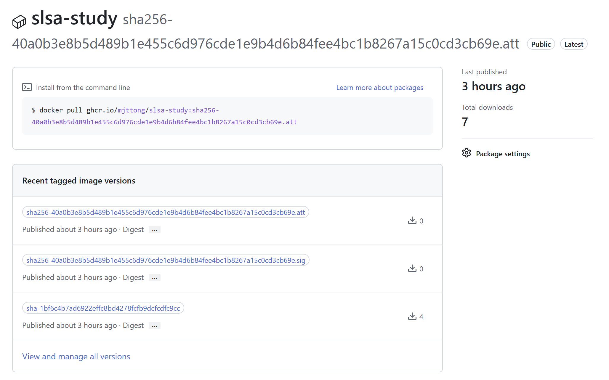
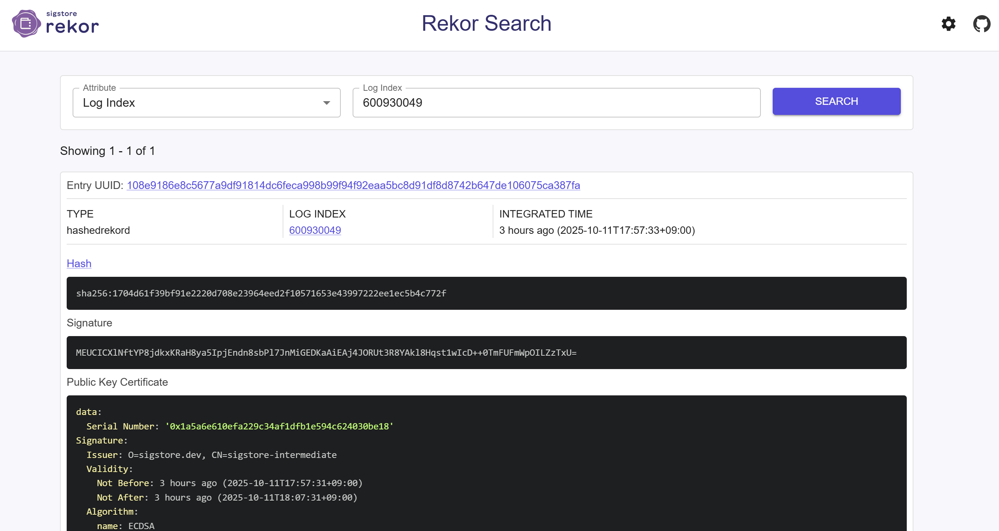

# Kubernetes Policy

> <https://github.com/mjttong/slsa-study>
>
> CI workflow, k8s deploy, policy는 위 리포지토리에서 확인 가능하다.

## CI 환경 구성: github actions

### workflow

- docker image 생성 및 캐싱
- trivy를 통한 취약점 점검
  - 레지스트리에 취약점이 있는 이미지가 push되지 않도록 함
- ghcr 로그인 및 docker image push
- trivy를 통한 SBOM 생성
  - 해당 SBOM을 ghcr의 attestation으로 업로드
- cosign을 통한 ghcr 레지스트리에 push된 이미지 서명
  - keyless 방식, github OIDC 사용
  - keyless 방식에서 자동으로 rekor 공개 로그에 해당 서명이 기록됨

### 구성 요소

- cosign
  - 컨테이너 이미지에 서명 및 검증
  - key 방식: 로컬 키페어 생성 및 해당 키를 통한 서명
  - keyless 방식: 별도의 키페어 없이 OIDC를 통한 서명
- fulcio
  - cosign keyless 방식 사용 시 사용자의 OIDC 로그인 진행
  - 로그인 시 짧은 수명의 X.509 인증서 발급
- rekor
  - 투명 로그 시스템
  - 누구나 로그 검색 가능
  - 삭제 및 조작 불가능
- trivy
  - 소프트웨어 아티팩트 스캔
  - 취약점 탐지 및 SBOM(Software Bill of Material) 생성

### CI 결과물

- sign(sig), SBOM(att), docker image가 레지스트리에 push

- rekor 로그에 기록

## CD 환경 구성

### k8s object

- deployment
  - CI 과정에서 생성한 이미지를 pull 받아 Pod에 배포
- clusterPolicy
  - 이미지 출처가 ghcr.io/mjttong여야 함
  - cosign 서명(sig) 검증, sbom attestation(att) 검증
    - OIDC issuer가 github actions인지 검증
    - 해당 이미지가 서명된 리포지토리가 mjttong/slsa-study인지 검증
    - rekor 공개 로그 검증
    - digest 사용 강제

## 공격자 시나리오

- 공격자 목표: k8s에 악의적인 프로그램 배포

### OIDC 토큰 탈취

- 공격 시나리오
  - 공격자가 OIDC 토큰 탈취
  - 공격자의 워크플로우에서 악성 이미지에 OIDC 토큰으로 서명 후 배포
- 방어
  - kyverno 정책의 subject 검증으로 인해 정상 워크플로우에서 서명된 이미지만 허용
  - kyverno 정책의 imageReferences 검증으로 인해 정상 레지스트리 내 이미지만 허용
  - 공격자의 워크플로우에서 서명된 이미지, 공격자의 레지스트리에서 pull 받은 이미지는 배포 불가능

### 레지스트리 자격 증명 탈취

- 공격 시나리오
  - 공격자가 ghcr 토큰 탈취
  - 악성 이미지를 레지스트리에 직접 업로드
  - 공격자의 자체 서명 시도
- 방어
  - cosign keyless 방식으로 서명하기 때문에 OIDC 토큰 없이 유효한 서명 불가능
  - 서명 없는 이미지, 비정상 워크플로우에서 서명된 이미지는 kyverno 정책이 차단

## 현재 구성의 문제점

- Provenance 부재
- 리포지토리 쓰기 권한을 가진 단일 사용자가 모든 보안정책 우회 가능
  - 해당 사용자가 악의적인 코드를 업로드하는 경우, rekor 로그로 기록 추척은 가능해도 해당 배포를 막을 방법은 없음

### 평가

- SLSA level 1 통과
  - github actions를 통해 빌드 프로세스 문서화 및 로그 기록
- SLSA level 2
  - github actions를 통한 빌드 프로세스 자동화
  - SBOM attestation 생성
  - **Provenance 부재**
- SLSA level 3
  - github-hosted runner에서 격리되어 빌드 프로세스 실행
  - SBOM attestation 포함
  - Kyverno를 통한 배포 게이트 구성
  - **Provenance 부재**
- SLSA level 4
  - **2인 이상 승인 프로세스 부재**
